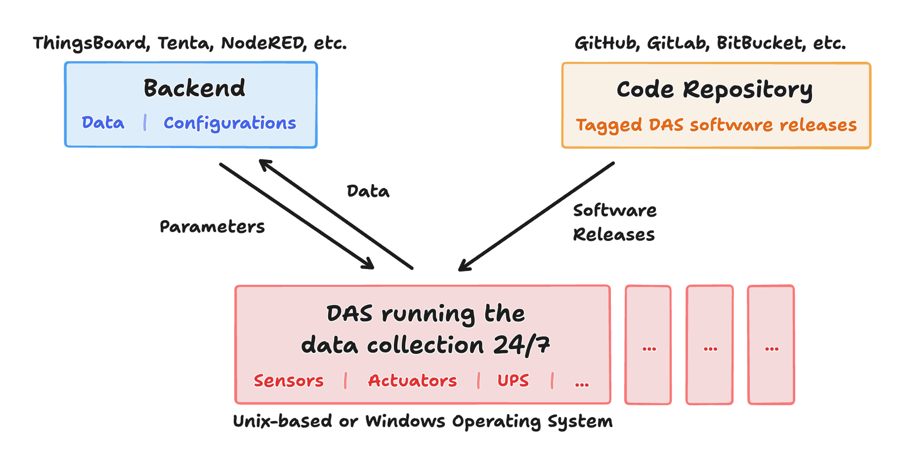
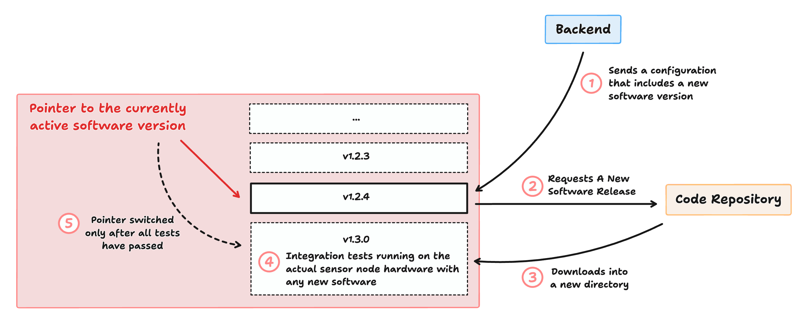

# Summary

Distributed sensor networks monitor environmental conditions at remote locations. Each sensor node produces various time series data streams and system logs and sends this data to a central backend. A "sensor node" is an autonomous system collecting data from one or multiple sensors connected to it, operated 24/7 by a Data Acquisition System (DAS).

Starting in 2022, we deployed a network of 20 autonomously operating GHG (greenhouse gas) sensor nodes as part of the ICOS Cities PAUL Project (Pilot Applications In Urban Landscapes) [@paul]. Visiting each sensor site on every configuration change or software update is not feasible when operating 20 or even more sensor nodes. To overcome this, we developed a DAS that supports remote configuration and software updates [@hermes;@moritzthesis]. The sensor node of Hermes is a Python-based DAS that runs on a Raspberry Pi and operates various sensors and actuators 24/7. The ability to update the DAS remotely enabled the frequent improvement of the sensor software after deployment.

Since the software architecture of a DAS is independent of a specific sensor network, we present Ivy – a boilerplate for a DAS that supports configuring and updating itself remotely. Research teams building a new sensor network can use Ivy as a base for their own network-specific DAS. Ivy combines our experiences in building and operating multiple sensor networks [@Dietrich2021;@hermes;@Aigner2023] since 2015. Ivy is designed to be owned and customized: One can switch to another documentation system, add another backend, or remove unused parts of the boilerplate.

{ width=85% }

\autoref{fig:architecture1} shows the system architecture of a sensor network using an autonomous DAS like Ivy. Multiple sensor networks built and operated by our research group could have been deployed significantly quicker and in better shape if they had been built on top of Ivy instead of starting from scratch [@Dietrich2021;@hermes;@Aigner2023] because Ivy would have already provided a stable architecture of the DAS.

This paper presents Ivy version 1.0, which has been build to the best of our knowledge about how a reliable and extendable DAS architecture can look like. We aim to continuously improve and extend the Ivy boilerplate based on the feedback from the community resulting from this publication.

# Statement of Need and Similar Efforts

Continuous and long-term monitoring of environmental parameters is crucial for understanding anthropogenic impacts on the environment [@IPCC_2021_WGI_SPM;@IPCC_2022_WGII_SPM]. Distributed sensor networks are used in various fields of research and industry to monitor greenhouse gases and atmospheric composition [@Shusterman2016;@Bares2019;@Dietrich2021], forest ecosystems [@AndersonTeixeira2014;@Zweifel2021;@Zweifel2023], soil moisture [@Dorigo2021;@AlYaari2018;@Bogena2022], and air quality [@Caubel2019;@Wenzel2021;@Popoola2018].

Deploying sensor nodes at remote locations is typically done in a one-off process — in a waterfall fashion: firstly, the DAS software is written, then the sensor node is configured, and finally deployed to the field. However, many studies report issues with the sensor operation after their deployment at scale. If the sensor node fails, it is not possible to change the configuration remotely or perform a software update of the DAS since the datastream is one-directional. This is either resolved by physically visiting the site or results in data loss. [@Bart2014;@Tolle2005]

Adding the possibility to send parameters and software updates to the sensor nodes remotely after the deployment helps resolving many of these issues efficiently. With Ivy, Research teams can deploy their sensor nodes and run them in real-world conditions earlier because bug fixes are quick to deploy. Teams are more likely to frequently improve their DAS if updating it on hundreds of sensor nodes can be done in a few minutes instead of weeks.

There are many existing systems available for data collection from sensor nodes. The FRaunhofer Opensource SensorThings (FROST) Server [@frost-server] is an open-source backend implementing the Open Geoscience Consortium (OGC) SensorThings API specification [@ogcsensorthingsapi]. The Things Network [@thethingsnetwork] provides a platform for managing LoRaWAN devices using The Things Stack [@thethingsstack]. Thingsboard [@thingsboard] and Tenta [@tenta] are similar platforms that provide MQTT and HTTP APIs, as well as a dashboard.

Whereas backends often provide client libraries for the software operating a sensor node [@frostpythonclient;@thingsboardclientsdk;@tentapythonclient], the code that is autonomously operating the sensor nodes is rarely published alongside research papers about sensor network applications. At the time of publishing this work, we could not find another open-source codebase powering the sensor side of a sensor network. This lack of open-sourced architecture decisions makes assessing how software operating an autonomous IoT system is built hard.

The Hermes software driving the Acropolis network has been open-sourced [@hermes;@moritzthesis;@felixthesis] and is running in production since early 2023. Its core architecture of internal communication, data and configuration handling has not changed since Version `v0.1.0-beta.2` and has enabled us to deploy 38 software updates – as of October 2024 – on the whole network since May 2023. However, the Hermes software is not reusable for similar networks without significant modifications, since it is tailored to the Acropolis network and has now been merged with other network specific parts [^2].

[^2]: See https://github.com/tum-esm/ACROPOLIS-edge

Ivy refines the DAS architecture of Hermes and makes it reusable for other sensor networks. Since the DAS does not require a specific backend, Ivy supports any backend, like the ones mentioned above. Ivy is a template repository that should be used as a base for a network-specific DAS owned by the research team building the sensor network.

# General System Design

Ivy uses a `config.json` file to store the parameters it is currently running with. This configuration file contains a revision number that connects data produced by the sensors to a specific configuration. Every configuration file should be run with a particular version of the DAS software stored inside this configuration file. The rest of the configuration file can be structured as needed.

Ivy listens to changes of the configuration from the backend. Whenever Ivy receives a new configuration from the backend, it can change the config file it runs with or perform a software update. The software update logic is built into the DAS, meaning the update logic itself can be updated.

As depicted in \autoref{fig:architecture2}: Firstly, Ivy will download new software releases into a separate directory than the one it is running on. Then, Ivy will install the dependencies of the new version and run the test suite on the local hardware. Only if the tests are successful, Ivy will switch the pointer from the currently running version to the new version. By this it is ensured that the DAS does not update itself to a version that does not run on the local hardware. The tests required to pass for an update to be "accepted" can be defined by the developer inside the new version's code using PyTest cases.

A strong focus was set on avoiding deadlocks in the system. If the system crashes for any reason during an update, it can start up again regularly without data loss. The only moment in time where a crash could render the system non-functional is during switching the pointer from the currently running version to the new version. As of October 2024, we have never experienced this deadlock on any of the 20 systems.

Ivy comes with connectors for two backends out of the box – Thingsboard [@thingsboard] and Tenta [@tenta] – and uses the MQTT protocol to communicate with them. Nevertheless, Ivy is not bound to a specific backend or communication protocol. This flexibility boosts the reusability of the boilerplate. Having the option to easily switch backends prevents vendor lock-in. Possible future backends are the FROST Server [@frost-server], more general-purpose backends like Strapi [@strapi] or Kuzzle [@kuzzle], any backend implementing the OGC SensorThings API [@ogcsensorthingsapi], or any other custom backend.

## Evolution of the Runtime Model

Both of our previously developed DASs, Pyra [@Aigner2023] and Hermes [@hermes] use a mixture of single- and multi-threading. Most of the logic runs on the main thread, and some independent parts run on separate threads. The downside of that non-isolated approach is that a failure in one system component will block the other system components from being executed.

Ivy replaces this mixture model with a fully parallel approach. Each block of functionality that should run in an infinite loop – until the software is stopped – is packaged into a "procedure". The "mainloop" is only responsible for dispatching procedures and handling software updates and parameter changes.

Due to this architectural difference, the logic running on the mainloop is significantly reduced compared to Pyra and Hermes, making it more stable. As shown in \autoref{fig:architecture3}, the communication between procedures is established using a shared state rather than direct point-to-point communication. The logic for sending messages to the backend – data and logs – is packaged and treated as a regular procedure.

## Testing and Documentation

Ivy contains complete static type hints and is strictly checked using Mypy [@mypy]. The Ivy boilerplate includes a test suite runing on every commit to the repository using GitHub Actions [@ghactions]. The test suite contains a test that tries to update a known working version to the current codebase and a test that tries to update the current codebase to a known working version.

Since the boilerplate targets teams developing their own DAS, it includes an API reference rendered in the documentation website. The API reference is generated automatically from the codebase. It contains rendered schema references for all JSON files one would interact with (configuration file, local message archive, shared state).

# Author Contributions

MM developed the sensor side software of Hermes in his master's thesis; FB wrote his master's thesis about the server of Hermes; PA advised these master theses and works on the carbon dioxide sensor network driven by Hermes; MM and PA authored Pyra powering MUCCnet; MM maintains Pyra; JC initialized the development of the carbon dioxide sensor networks driven by Hermes and Pyra, and helped with her expertise in environmental sensing applications; MM wrote the Ivy boilerplate; MM wrote the manuscript; JC reviewed the manuscript.

# References
